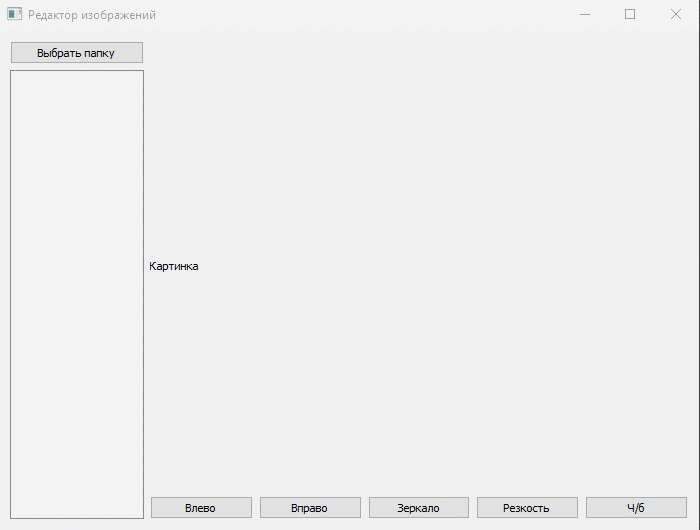

# Редактор изображений 
доступные фильтры
* черно- белое 
* размытие 
* поворот в право в лево 
* вертикально зеркало 

### Сценарий 
1. выбрать папку с изображениями,нажав на соответствующию кнопку в программе 
2. выбрать из появившегося списка изоображение 
3. приминить желаемый фильтр 

Примечание: к одному изоображению приминяется один фильтр
Измененная картинка автоматически сохраняется в папку "Modifiend" создается в выбранной папке.

### Пример работы 
